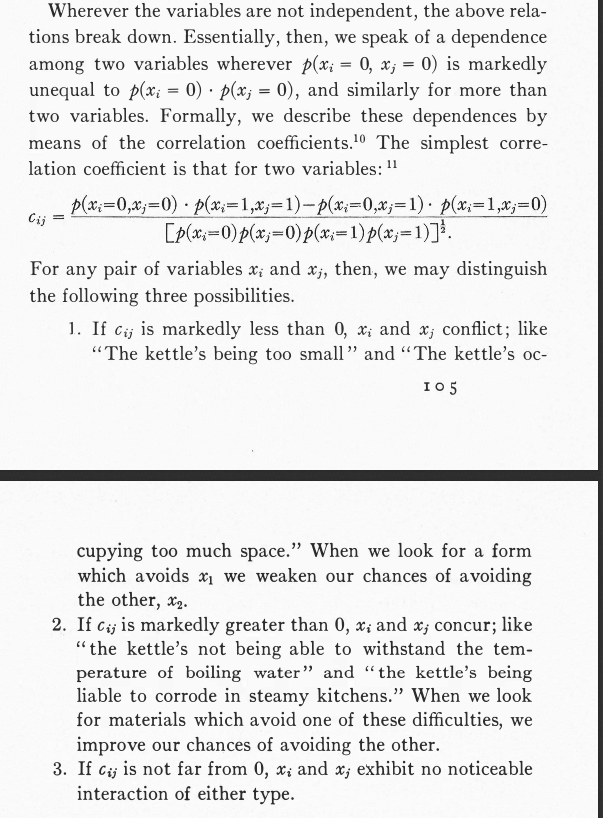

# Notsof

- [[read]] [[notes-on-the-synthesis-of-form]]
  - [[go]] https://anagora.org/go/notes-on-the-synthesis-of-form/hypothesis
  - [[old]] https://via.hypothes.is/stoa.anagora.org/notsof.pdf
- [[systems]], [[models]]

## Introduction
- See annotations/highlights for now
## Part One
### Goodness of Fit

- The ultimate [[object of design]] is [[form]].
- [[form]] + [[context]] == [[ensemble]]
- It is peculiar how much of the comments on [[ensembles]] apply to [[systems]] in general. This book so far often reads like [[christopher alexander]] has independently discovered principles in use in [[computer science]]; or, of course, perhaps [[computer science]] is just one possible take on the nature of [[complex systems]].
  - I am curious to know if people in the reading group with different backgrounds to mine, but whose primary activity is also not [[architecture]], get similar impressions w.r.t. their disciplines.
- The [[rightness of form]] depends on the degree to which a form fits an [[ensemble]] .
- Ensembles can be decomposed into many (nested, overlapped) [[form-context boundaries]].
  - But in any given analysis the boundary should probably be kept constant.
- [[p19]] "The form is a part of the world over which we have control, and which we decide to shape while leaving the rest of the world as it is. The context is that part of the world which puts [[demands]] on this form; anything in the world that makes demands of the form is context. [[Fitness]] is a [[relation]] of [[mutual acceptability]] between these two. In a problem of design we want to satisfy the mutual demands which the two make on one another. We want to put the context and the form into [[effortless contact]] or [[frictionless coexistence]]."
- [[p20]] interesting/surprising use of [[impossible]].
- [[p21]] negative perception of fit, in the sense that we notice [[misfit]] and see its absence as [[fit]].
- [[p24]] achieving good fit via neutralizing misfits
  - [[simonpjw]] comment about misfits as beautiful
- [[p25]] an exhaustive description of requirements for good fit probably includes the universe. This problem only seems tractable usually because of shared [[context]].
- [[p27]] a procedure based on listing misfits "most likely to occur". See comment.

### The Source of Good Fit

- [[p32]] Who is [[macbirdy]]? I like their reading.
- [[p33]] A lot of this chapter feels a bit problematic, outdated in its description of "unselfconscious cultures".
- [[37]] [[macbirdy]] on a roll
- [[meta]] my reading is turning more critical/nitpicky as I go through this chapter.

### Meeting with the group
- Andreas said that it was sometimes hard to remember 'design' meant architectural as the ties to graphic design were so solid
- [[armengol]] primes and [[factoring]]

### The Unselfconscious Process
- I still find this 'unselfconscious' characterization problematic, but I'll let it go -- if I don't I won't get the point, probably.
- I liked the [[slovakian shawls]] example.
  - Recognizing and curbing bad mutations != ability to introduce good mutations.

### The Selfconscious Process
- [[samoa]]
  - [[competition]] -> [[market dynamics]] -> [[specialization]] and development of [[individuality]]
- local [[mutations]], [[reputation]]
  - parallels with the development of [[authorship]] in art?
- [[p62]] category trees
  - We invent theories to alleviate the burden of freedom from tradition.

## Part Two
### The Program
- [[set theory]]
  - [[proper-subset]]
- decomposing [[misfits]] ~ [[decomposing problems]]
- thesis: for every problem there is one decomposition which is "specially proper" to it
  - we call this the [[program]] for the problem G(M, I) where
    - G = graph, [[topological 1-complex]]
    - M = set of misfits, nodes
    - L = set of interactions, links, edges

### The Realization of the Program
- Two phases:
  - analysis, where the right design [[program]] is found
    - a tree of sets of requirements / the previous graph
  - synthesis, where the right [[form]] is derived from the program
    - a tree of [[diagrams]]
- examples of [[diagrams]]
  - [[le corbusier]]'s [[ville radieuse]] is a diagram stemming from two requirements: high density and equal/max access to sunlight and air
  - a [[sphere]], for the requirement to enclose a maximum volume within a surface
  - engineer sketches, [[kekulé]]'s representation of benzene
  - in general they:
    - summarize  aspects of physical structure: a [[form diagram]]
    - summarize functional properties or constraints: a [[requirement diagram]]
    - just one or just the other isn't very useful; a good ("constructive") diagram has elements of both.
- two ways to describe [[form]]:
  - [[formal]], what it "is"
  - [[functional]], what it "does"
- a unified description is the abstract equivalent of a constructive diagram
  - a constructive diagram can often *precede* the knowledge which explains its shape
  - [[aside]]
    - [[visual cortex]], [[eric weinstein]]
- "the program is a hierarchy of the most significant subsets of M"
  - this is looking more and more like a [[graph partitioning]] problem

### Definitions
- performance standards are based on scales that estimate fit/misfit in certain domains. quantifiable; miss the [[qualitative]].
- we model problems with fit/misfit as booleans; although they might actually represent quantitative continuous variables plus a threshold, or qualitative opinions by people explicitly expressed
  - fit = 0
  - misfit = 1
  - "Let us remind ourselves of the fundamental principle. Any state of affairs in the ensemble which derives from the interaction between form and context, and causes stress in the ensemble, is  a misfit."
- [[misfit]] is left as a primitive notion (undefined)
- [[domain]] is the totaility of possible forms within the cognitive reach of the designer
- [[probabilities]] enter the stage! Finally. They seem to make sense in this context.
  - as usual, when probabilities are independent all's nice and well.
  - correlation coefficient: 
   
